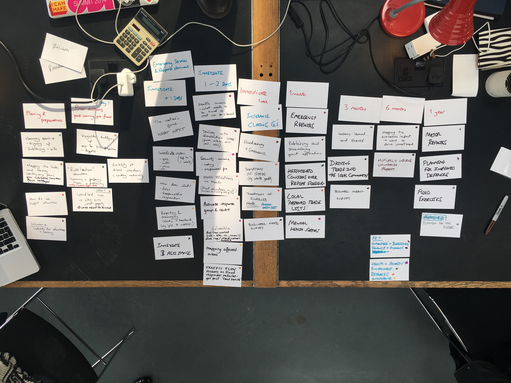
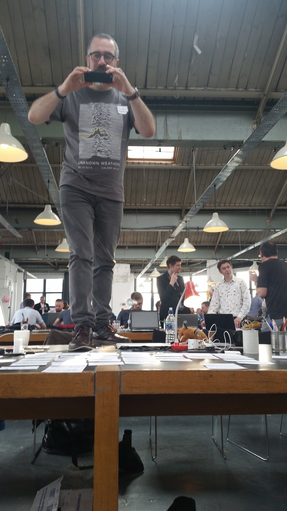

We came together as a team to discuss the recovery efforts, which we defined as just post the flooding event, and felt the recovery would change focus over the weeks and months following.

We first began by mapping our areas of concern on index cards.

We captured this in a [computer-readable format](data/recovery_map.yml)
